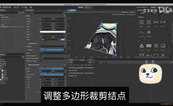
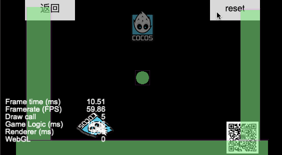
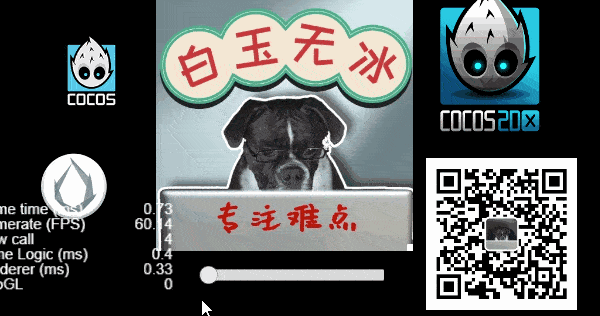
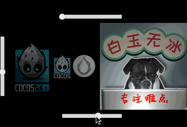

# 2.4.x demo

cocos creator 2.4.x demo

## demo01

brightness/saturation/constrast 
(亮度/饱和度/对比度 两种实现方式)

https://mp.weixin.qq.com/s/bKjJS3KX2rEI0F7_4QPJEw

  

## demo02

多边形裁剪图片与gizmo

https://mp.weixin.qq.com/s/EkMP_UcFcWTlSn_4Ml8zsA

  

## demo03

Cocos Creator Liquidfun

https://mp.weixin.qq.com/s/T-xkgkLonYqA_4yqPIYLSg

  

## demo04

噪声纹理之消融效果！ shader 入门精要！ Cocos Creator Shader !

https://mp.weixin.qq.com/s/9od3cxdinGJ4q8Zjfc4qFQ

  


## demo05

2d图片光照效果， add 2d sprite a base light (Blinn-Phong Light Model)

基础光照模型！CocosCreator2D光照!  
https://mp.weixin.qq.com/s/RtARzTb9KahZ70Ct5r8GRw

  


## demo06

截图base64

---

导航：https://mp.weixin.qq.com/s/Ht0kIbaeBEds_wUeUlu8JQ

---

qq 交流群

859642112


```
/**
█████████████████████████████████████
█████████████████████████████████████
████ ▄▄▄▄▄ █▀█ █▄██▀▄ ▄▄██ ▄▄▄▄▄ ████
████ █   █ █▀▀▀█ ▀▄▀▀▀█▄▀█ █   █ ████
████ █▄▄▄█ █▀ █▀▀▀ ▀▄▄ ▄ █ █▄▄▄█ ████
████▄▄▄▄▄▄▄█▄▀ ▀▄█ ▀▄█▄▀ █▄▄▄▄▄▄▄████
████▄▄  ▄▀▄▄ ▄▀▄▀▀▄▄▄ █ █ ▀ ▀▄█▄▀████
████▀ ▄  █▄█▀█▄█▀█  ▀▄ █ ▀ ▄▄██▀█████
████ ▄▀▄▄▀▄ █▄▄█▄ ▀▄▀ ▀ ▀ ▀▀▀▄ █▀████
████▀ ██ ▀▄ ▄██ ▄█▀▄ ██▀ ▀ █▄█▄▀█████
████   ▄██▄▀ █▀▄▀▄▀▄▄▄▄ ▀█▀ ▀▀ █▀████
████ █▄ █ ▄ █▀ █▀▄█▄▄▄▄▀▄▄█▄▄▄▄▀█████
████▄█▄█▄█▄█▀ ▄█▄   ▀▄██ ▄▄▄ ▀   ████
████ ▄▄▄▄▄ █▄██ ▄█▀  ▄   █▄█  ▄▀█████
████ █   █ █ ▄█▄ ▀  ▀▀██ ▄▄▄▄ ▄▀ ████
████ █▄▄▄█ █ ▄▄▀ ▄█▄█▄█▄ ▀▄   ▄ █████
████▄▄▄▄▄▄▄█▄██▄▄██▄▄▄█████▄▄█▄██████
█████████████████████████████████████
█████████████████████████████████████
 */
```