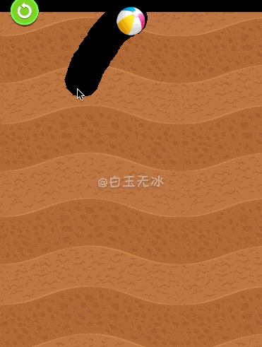
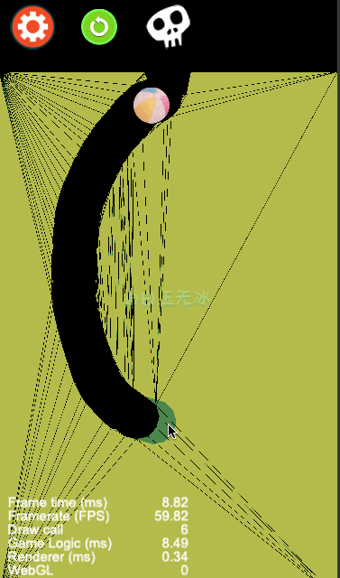

# 挖洞效果

cocos creator v2.3.3  

## 分块挖洞

`Main_poly_piecewise.fire`



图文: https://mp.weixin.qq.com/s/5JbIX7kHyZoGvJjGrXaZug


## 多边形刚体挖洞

`Main_poly.fire`



填坑篇:  https://mp.weixin.qq.com/s/bL4VTlmzAO7ZzxB9NZ-R8A   
图文讲解: https://mp.weixin.qq.com/s/jxKeM2Ah5UHlGTryksdr6Q   

---

## 链条挖洞 

`Main.fire`

物理挖洞！涂抹地形! 优化篇来了！图文！视频！源码！通通来了！

优化篇原文:  https://mp.weixin.qq.com/s/4lFv9p346yEg_PSOwN0WKw  
优化篇视频:  https://b23.tv/BV1GV411d7eq  

实现篇:  https://mp.weixin.qq.com/s/Xcf-WPaqiIo-ef6O_IITFg   
实现篇视频讲解  https://b23.tv/BV1jz411z7w1   
在线体验:  http://lamyoung.gitee.io/web/dig_hole/   


---

qq 交流群

859642112


```
/**
█████████████████████████████████████
█████████████████████████████████████
████ ▄▄▄▄▄ █▀█ █▄██▀▄ ▄▄██ ▄▄▄▄▄ ████
████ █   █ █▀▀▀█ ▀▄▀▀▀█▄▀█ █   █ ████
████ █▄▄▄█ █▀ █▀▀▀ ▀▄▄ ▄ █ █▄▄▄█ ████
████▄▄▄▄▄▄▄█▄▀ ▀▄█ ▀▄█▄▀ █▄▄▄▄▄▄▄████
████▄▄  ▄▀▄▄ ▄▀▄▀▀▄▄▄ █ █ ▀ ▀▄█▄▀████
████▀ ▄  █▄█▀█▄█▀█  ▀▄ █ ▀ ▄▄██▀█████
████ ▄▀▄▄▀▄ █▄▄█▄ ▀▄▀ ▀ ▀ ▀▀▀▄ █▀████
████▀ ██ ▀▄ ▄██ ▄█▀▄ ██▀ ▀ █▄█▄▀█████
████   ▄██▄▀ █▀▄▀▄▀▄▄▄▄ ▀█▀ ▀▀ █▀████
████ █▄ █ ▄ █▀ █▀▄█▄▄▄▄▀▄▄█▄▄▄▄▀█████
████▄█▄█▄█▄█▀ ▄█▄   ▀▄██ ▄▄▄ ▀   ████
████ ▄▄▄▄▄ █▄██ ▄█▀  ▄   █▄█  ▄▀█████
████ █   █ █ ▄█▄ ▀  ▀▀██ ▄▄▄▄ ▄▀ ████
████ █▄▄▄█ █ ▄▄▀ ▄█▄█▄█▄ ▀▄   ▄ █████
████▄▄▄▄▄▄▄█▄██▄▄██▄▄▄█████▄▄█▄██████
█████████████████████████████████████
█████████████████████████████████████
 */
```