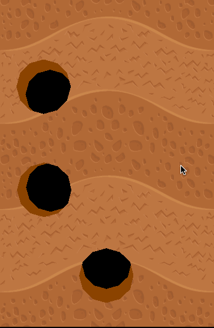

# 挖洞效果-3d 效果

cocos creator v2.3.3  



图文：https://mp.weixin.qq.com/s/LJCdpdiRn9vZe83pf3ysUg

代码由qq群(859642112)的大佬提供 `@云谷` ， 思路由 `@菠萝菠萝` 提供！感谢小伙伴们的分享。    

由`@白玉无冰`整理～   

---

前篇基础～   

填坑篇:  https://mp.weixin.qq.com/s/bL4VTlmzAO7ZzxB9NZ-R8A   
图文讲解: https://mp.weixin.qq.com/s/jxKeM2Ah5UHlGTryksdr6Q   
meshTexture: https://mp.weixin.qq.com/s/r1IEcFXdy4O2Fn4IPs1m_w   


---

qq 交流群

859642112


```
/**
█████████████████████████████████████
█████████████████████████████████████
████ ▄▄▄▄▄ █▀█ █▄██▀▄ ▄▄██ ▄▄▄▄▄ ████
████ █   █ █▀▀▀█ ▀▄▀▀▀█▄▀█ █   █ ████
████ █▄▄▄█ █▀ █▀▀▀ ▀▄▄ ▄ █ █▄▄▄█ ████
████▄▄▄▄▄▄▄█▄▀ ▀▄█ ▀▄█▄▀ █▄▄▄▄▄▄▄████
████▄▄  ▄▀▄▄ ▄▀▄▀▀▄▄▄ █ █ ▀ ▀▄█▄▀████
████▀ ▄  █▄█▀█▄█▀█  ▀▄ █ ▀ ▄▄██▀█████
████ ▄▀▄▄▀▄ █▄▄█▄ ▀▄▀ ▀ ▀ ▀▀▀▄ █▀████
████▀ ██ ▀▄ ▄██ ▄█▀▄ ██▀ ▀ █▄█▄▀█████
████   ▄██▄▀ █▀▄▀▄▀▄▄▄▄ ▀█▀ ▀▀ █▀████
████ █▄ █ ▄ █▀ █▀▄█▄▄▄▄▀▄▄█▄▄▄▄▀█████
████▄█▄█▄█▄█▀ ▄█▄   ▀▄██ ▄▄▄ ▀   ████
████ ▄▄▄▄▄ █▄██ ▄█▀  ▄   █▄█  ▄▀█████
████ █   █ █ ▄█▄ ▀  ▀▀██ ▄▄▄▄ ▄▀ ████
████ █▄▄▄█ █ ▄▄▀ ▄█▄█▄█▄ ▀▄   ▄ █████
████▄▄▄▄▄▄▄█▄██▄▄██▄▄▄█████▄▄█▄██████
█████████████████████████████████████
█████████████████████████████████████
 */
```