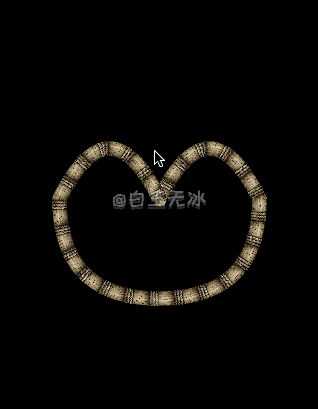
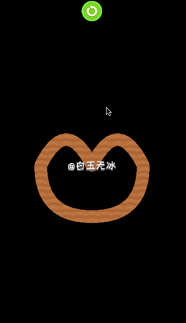

# 画线-纹理

cocos creator v2.3.3   

`cc.Graphics` + `cc.Sprite` 实现画线纹理。   

## `main_rope.fire` 有方向的纹理，类似绳子。   

图文:   
part-3: https://mp.weixin.qq.com/s/QvJ2DHFhUxO3doNviCqBIg   



## `main.fire` 普通纹理。

图文:  
part-1:  https://mp.weixin.qq.com/s/ozXjdpyid5f2Xwo7uo0MuQ    
part-2:  https://mp.weixin.qq.com/s/xniwz-a_FI0snWqqPd2NOg    




前置教程: [初探精灵中的网格渲染模式 ！](https://mp.weixin.qq.com/s/2FcixeoV-Fg-7OodILECeg)  

---

导航：https://mp.weixin.qq.com/s/Ht0kIbaeBEds_wUeUlu8JQ

---

qq 交流群

859642112


```
/**
█████████████████████████████████████
█████████████████████████████████████
████ ▄▄▄▄▄ █▀█ █▄██▀▄ ▄▄██ ▄▄▄▄▄ ████
████ █   █ █▀▀▀█ ▀▄▀▀▀█▄▀█ █   █ ████
████ █▄▄▄█ █▀ █▀▀▀ ▀▄▄ ▄ █ █▄▄▄█ ████
████▄▄▄▄▄▄▄█▄▀ ▀▄█ ▀▄█▄▀ █▄▄▄▄▄▄▄████
████▄▄  ▄▀▄▄ ▄▀▄▀▀▄▄▄ █ █ ▀ ▀▄█▄▀████
████▀ ▄  █▄█▀█▄█▀█  ▀▄ █ ▀ ▄▄██▀█████
████ ▄▀▄▄▀▄ █▄▄█▄ ▀▄▀ ▀ ▀ ▀▀▀▄ █▀████
████▀ ██ ▀▄ ▄██ ▄█▀▄ ██▀ ▀ █▄█▄▀█████
████   ▄██▄▀ █▀▄▀▄▀▄▄▄▄ ▀█▀ ▀▀ █▀████
████ █▄ █ ▄ █▀ █▀▄█▄▄▄▄▀▄▄█▄▄▄▄▀█████
████▄█▄█▄█▄█▀ ▄█▄   ▀▄██ ▄▄▄ ▀   ████
████ ▄▄▄▄▄ █▄██ ▄█▀  ▄   █▄█  ▄▀█████
████ █   █ █ ▄█▄ ▀  ▀▀██ ▄▄▄▄ ▄▀ ████
████ █▄▄▄█ █ ▄▄▀ ▄█▄█▄█▄ ▀▄   ▄ █████
████▄▄▄▄▄▄▄█▄██▄▄██▄▄▄█████▄▄█▄██████
█████████████████████████████████████
█████████████████████████████████████
 */
```