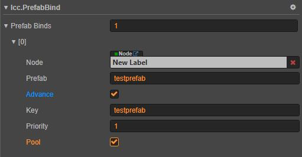

****
[客户端框架文档](./1.客户端框架文档.md)<br/>
****
<br/>

# **预制体模块**

预制体模块用于管理游戏中使用预制体，提供预制体创建和释放优化，用于配置的预制体单例对象的管理。特别是需要在跨分包使用预制体的时候，这个模块可以简化管理方式。由于该框架是基于多分包的模块化游戏内容组织框架，所以预制体配置和资源文件也是分散在分包中的，分包内只应该包含当前分包的预制体配置和资源文件。

## **模块功能说明**

1. ### 用于配置的预制体单例
    因为在预制体上保存资源引用十分方便，所有我们可能想把一些配置参数通过预制体保存。比如引用大量资源，我们只需要实例化预制体就可以使用上面的资源。但是，预制体应该只保存比较少量的配置；因为，如果修改大量预制体配置参数，耗时比直接修改Excel配置多得多。

## **模块基础用法**

1. ### 创建预制体资源和配置文件
    所有`预制体资源和配置文件`都应该在分包目录下，`预制体资源文件`就是具体预制体文件，`预制体配置文件`就是预制体资源索引文件。<br/>
    下面的例子可以具体说明创建和配置的流程。<br/>
    比如在`resources`分包创建名为`testprefab`的预制体配置。具体步骤如下；<br/>
    * 在`resources`分包目录下创建`testprefab.prefab`预制体文件。然后打开预制体以编辑预制体。
    * 在`resources`分包目录下创建`prefab-indexs.json`预制体资源索引文件（也可以直接修改包内其他资源索引文件）。编辑该索引文件，在`prefab`索引路径下加入`testprefab`预制体的配置，如下；<br/>
        ```
            {
                "prefab":{
                    "testprefab":{
                        "file":"asset://resources/testprefab",
                        "pool" : true,
                    }
                }
            }
        ```
        `file`表示预制体文件路径。<br/>
        `pool`表示默认会在节点池中创建预制体。

    * 在`resources`分包根目录下创建`index-files.json`资源索引文件目录（如果不存在这个文件），然后把`prefab-indexs.json`预制体资源索引文件引用加入到`index-files.json`文件中，如下；<br/>
        ```
            {
                .... // 其他索引文件引用

                "prefab":"asset://resources/prefab-indexs"
            }
        ```
        至此，`testprefab`预制体创建和配置完成。

2. ### 预制体脚本组件
    预制体脚本组件用于控制指定的预制体，我们可以把预制体的操作封装在预制体脚本组件中。我们需要在预制体任意节点上挂载继承于`lcc.PrefabBase`的预制体脚本组件
    如下，自定义预制体组件脚本文件`TestPrefab.ts`：<br/>
    ```
        @ccclass
        export class TestPrefab extends lcc.PrefabBase {
            doSomething(){
                // 动态修改预制体
                this.node.active = true;
            }
        }
    ```
    把`TestPrefab.ts`预制体组件脚本添加到`testprefab.prefab`预制体内任意节点上，通过`TestPrefab`控制对应预制体。

3. ### 创建和释放预制体
    该模块可以根据情况，是否需要在节点池中创建和释放预制体。如下操作：<br/>
    ```
        // 创建testprefab配置的预制体，不在节点池中。第二个pool参数会覆盖配置中的设置
        let instance = lcc.prefabMgr.createPrefab('testprefab', false);

        // 释放instance，不在节点池中。第二个pool参数会覆盖配置中的设置
        lcc.prefabMgr.releasePrefab(instance, false);
    ```
    `releasePrefab()`函数会返回预制体上挂载的预制体脚本组件。如果在预制体上没有挂载预制体脚本组件，那么这里会直接添加`lcc.PrefabBase`作为这个预制体的脚本组件。

4. ### 获得和释放用于配置的预制体对象
    用于配置的预制体对象应该属于单例对象，即每次获得的都是同一个对象。如下操作：<br/>
    ```
        // 获得 testprefab 配置的单例1
        let instance1 = await lcc.prefabMgr.getPrefabInstance('testprefab');

        // 获得 testprefab 配置的单例2
        let instance2 = await lcc.prefabMgr.getPrefabInstance('testprefab');

        // instance1和instance2应该是相同的。
        if(instance1 === instance2){
            // 这里会执行
        }
    ```
    一般这种单例对象应该是伴随着整个游戏进程，但是我们也可以手动释放。特别注意释放的时候要确保其他地方没有引用，否则可能出现无法预计后果。操作如下：<br/>
    ```
        lcc.prefabMgr.releasePrefabInstance('testprefab');
    ```

5. ### 通过组件，在预制体或场景某些节点上绑定配置预制体
    如果我们需要在预制体或者场景上，引用远程分包中配置的预制体怎么办呢？<br/>
    我们可以在节点上挂载`lcc.PrefabBind`组件实现这个功能。<br/>
    <br/>
    `Node` 表示实例化的预制体的父节点。<br/>
    `Prefab` 表示预制体配置名称。<br/>
    `Advance` 高级选项。<br/>
    `Key` 可选，实例化对象引用健，如果需要手动操作lcc.PrefabBind组件，可以通过Key获得预制体脚本组件。默认为预制体名。<br/>
    `Priority` 可选，实例化对象的优先级，也就是zIndex值。默认为0<br/>
    `Pool` 可选，是否在节点池中实例化预制体。默认为false<br/>


