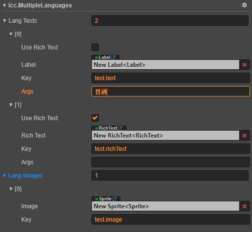

****
[客户端框架文档](./1.客户端框架文档.md)<br/>
****
<br/>

# **多语言模块**

多语言模块可以动态切换游戏中显示的语言，主要是通过多语言配置把对应文本和图片修改为对应语言的文本和图片。由于该框架是基于多分包的模块化游戏内容组织框架，所以多语言的配置和资源文件是分散在分包中的，分包内只应该包含当前分包的多语言配置和资源文件。

## **模块功能说明**

使用多语言模块，首先需要在对应的原始资源分包目录下，通过特定表格配置多语言；然后通过该框架配套资源构建工具，生成分包的多语言配置文件。在游戏中加载对应分包后，就可以使用指定的语言的配置。<br/>
生成语言配置的操作在该框架配套资源构建工具中完成，可以先看原始资源配置和构建文档中关于多语言的部分。

1. ### 关于多语言文字和图片的健(key)
    由于在切换语言的时候需要切换对应的文字和图片，所以我们需要把每个涉及多语言的文字和图片唯一标识起来，每种语言都需要有与之对应的值。

## **模块初始化**

多语言模块初始化最好在框架加载后，多语言功能使用前完成。当然也可以用默认参数使用，不初始化多语言模块。<br/>

1. ### 设置默认语言
    可以通过如下设置默认语言：<br/>
    ```
        lcc.DEFAULT_LANGUAGE = 'en';
    ```
    当前模块默认语言为`zh`。

## **模块基础用法**

该模块主要的操作有加载多语言前置配置、设置并更新指定语言、手动替换文字和图片与组件替换文字和图片。

1. ### 创建多语言资源和配置文件
    `多语言资源和配置文件`应该是由配套的资源构建工具生成的，这里主要说明`多语言资源和配置文件`的格式和如何手动添加。<br/>
    所有`多语言资源和配置文件`都应该在分包目录下，`多语言资源文件`就是包含对应语言的文字和图片信息，`多语言配置文件`就是多语言资源索引文件。<br/>
    下面的例子可以具体说明创建和配置的流程。<br/>
    比如在`resources`分包创建名为`zh`的语言，具体步骤如下；<br/>
    * 在`resources`分包目录下创建名为`zh.json`的JSON文件。然后编辑该JSON文件内容如下：<br/>
        ```
            {
                "texts": {
                    "text1": {
                        "text": "开火"
                    }
                },
                "images":{
                    "image1":"asset://resources/image1"
                }
            }
        ```
        其中，`texts`表示文字映射内容，`images`表示图片映射内容。<br/>
        可以看出，还需要在`resources`分包目录添加一张名为`image1.png`或者其他格式的图片文件。
     * 在`resources`分包目录下创建`lang-indexs.json`多语言资源索引文件（也可以直接修改包内其他资源索引文件）。编辑该索引文件，在`lang`索引路径下加入`zh`语言的配置，如下；<br/>
        ```
            {
                "lang": {
                    "zh": [
                        "asset://resources//zh"
                    ]
                }
            }
        ```
        每个语言的配置也是文件数组，说明每个语言可以由多个文件合并而成。
    * 在`resources`分包根目录下创建`index-files.json`资源索引文件目录（如果不存在这个文件），然后把`lang-indexs.json`多语言资源索引文件引用加入到`index-files.json`文件中，如下；<br/>
        ```
            {
                .... // 其他索引文件引用

                "lang":"asset://resources/lang-indexs"
            }
        ```
        至此，`zh`语言创建和配置完成。

1. ### 加载多语言前置配置
    由于模块化分包加载需要时间，如果想在加载前使用多语言某些文字和图片，那么就需要加载语言前置配置。多语言前置配置和其包含的资源都会在`resources`分包中。如下操作：<br/>
    ```
        await lcc.langMgr.loadPreposeLangs();
    ```
    这样，我们就可以在分包加载前，使用多语言配置的前置文字和图片，一般用在加载场景上。

2. ### 设置并更新指定语言
    我们设置的语言应该是已有配置的语言。<br/>
    例如，我们在原始资源目录配置`zh`语言文件，通过构建工具构建后，我们就可以使用`zh`语言。如下：<br/>
    ```
        await lcc.langMgr.setLanguage('zh');
    ```
    `setLanguage()`是异步函数，因为当设置语言后，会触发场景中的文字和图片的替换操作。我们可以使用`await`等待场景中多语言更新完成。

3. ### 手动替换文字和图片
    我们可以监听语言的切换操作，以便能在代码中更灵活的修改多语言文字和图片。但是，手动替换需要注意一些细节，除非必要，否则不推荐使用<br/>
    如下操作；<br/>
    ```
        // 普通文本
        @property(cc.Label)
        private text:cc.Label;

        // 富文本
        @property(cc.RichText)
        private richText:cc.RichText;

        // 图片
        @property(cc.Sprite)
        private image:cc.Sprite;

        // start里面监听语言变换
        start(){
            lcc.langMgr.on('lang_changed', (lang:string)=>{
                // 当语言切换时回调， lang标识切换后的语言

                /*
                    更新文本对象：this.text
                    多语言文本健：test.text
                    附带格式化参数：普通
                */
                lcc.langMgr.updateText(this.text, 'test.text', '普通');

                /*
                    更新文本对象：this.richText
                    多语言文本健：test.richText
                */
                lcc.langMgr.updateText(this.richText, 'test.richText');

                /*
                    更新图片对象：this.image
                    多语言图片健：test.image
                */
                lcc.langMgr.updateImage(this.image, 'test.image');
            });
        }
    ```
    多语言文本可以是格式化的字符串，我们可以通过`updateText()`传递`格式化参数`得到最终文本。<br/>
    当然，我们还有更灵活的方式修改对语言文字和图片，如下：<br/>
    ```
        lcc.langMgr.on('lang_changed', async (lang:string)=>{

            // 增加多语言更新中引用
            lcc.langMgr.addLangUpdating();

            /*
                更新文本对象：this.text
                多语言文本健：test.text
                附带格式化参数：普通
            */
            this.text.string = lcc.langMgr.getText('test.text', '普通');

            /*
                更新文本对象：this.richText
                多语言文本健：test.richText
            */
            this.richText.string = lcc.langMgr.getText('test.richText');

            /*
                更新图片对象：this.image
                多语言图片健：test.image
            */
            this.image.spriteFrame = await lcc.langMgr.getImage('test.image');

            // 减少多语言更新中引用
            lcc.langMgr.decLangUpdating();
        });
    ```
    上面实现的功能是一样的。但是，我们必须要手动操作多语言更新计数器，也就是把具体更新代码放在`addLangUpdating()`与`decLangUpdating()`之间，否则框架不能知道更新结束操作。

4. ### 组件替换文字和图片
    我们也可以通过在节点上挂载`lcc.MultipleLanguages`组件，并配置多语言文本和图片，以实现多语言功能。`推荐使用`<br/>
    如下实例：<br/>
    <br/>
    上面组件实现的效果和`手动替换文字和图片`一样，但是使用更方便。

