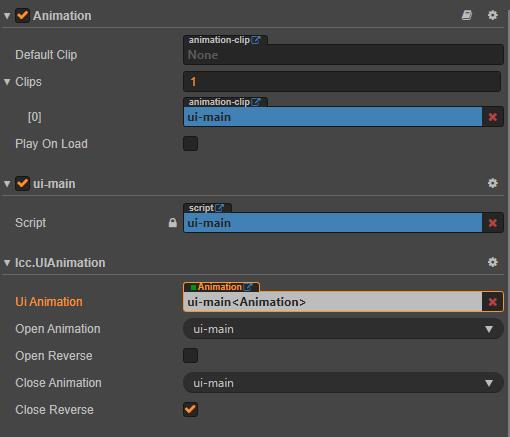

****
[客户端框架文档](./1.客户端框架文档.md)<br/>
****
<br/>

# **UI模块**

UI模块管理游戏中使用的UI界面，主要包含UI界面资源的加载与释放、UI界面的生命周期与动画和UI界面的分组层级控制。由于该框架是基于多分包的模块化游戏内容组织框架，所以UI配置和资源文件也是分散在分包中的，分包内只应该包含当前分包的UI配置和资源文件。

## **模块功能说明**

UI界面其实是通过UI界面预制体实例化而成的节点，所以UI资源文件就是预制体文件。UI配置文件在配置UI的时候，除了引用UI预制体文件之外，还可以配置名称、分组和固定层级等参数。

## **模块基础用法**

1. ### 创建UI资源和配置文件
    所有`UI资源和配置文件`都应该在分包目录下，`UI资源文件`就是UI界面的预制体文件，`UI配置文件`就是UI资源索引文件。<br/>
    下面的例子可以具体说明创建和配置的流程。<br/>
    比如在`resources`分包创建名为`testui`的UI界面，具体步骤如下；<br/>
    * 在`resources`分包目录下创建`testui.prefab`预制体文件。然后打开预制体以编辑UI界面。
    * 在`resources`分包目录下创建`ui-indexs.json`UI资源索引文件（也可以直接修改包内其他资源索引文件）。编辑该索引文件，在`ui`索引路径下加入`testui`UI界面的配置，如下；<br/>
        ```
            {
                "ui":{
                    "testui":{
                        "file":"asset://resources/testui",
                        "priority" : 100,
                        "canvas" : "TEST"
                    }
                }
            }
        ```
        如上面`testui`的UI配置；`file`表示UI界面预制体全路径；`priority`可选，表示在当前分组中固定层级数值（zIndex值）；`canvas`可选，表示指定的画布名称（分组名称）。
    * 在`resources`分包根目录下创建`index-files.json`资源索引文件目录（如果不存在这个文件），然后把`ui-indexs.json`UI资源索引文件引用加入到`index-files.json`文件中，如下；<br/>
        ```
            {
                .... // 其他索引文件引用

                "ui":"asset://resources/ui-indexs"
            }
        ```
        至此，`testui`UI界面创建和配置完成。

2. ### UI脚本组件
    UI界面在使用的过程中也存在创建、打开、关闭和销毁等生命周期状态。如果我们要监听UI界面的生命周期，那么需要在UI预制体任意节点上挂载继承于`lcc.UIBase`的UI脚本组件，并且在组件脚本里面重写`onUICreate()`、`onOpen()`、`onClose()`和`onUIRelease()`等生命周期函数。<br/>
    如下，接着上面的例子，自定义UI组件脚本文件`TestUI.ts`：<br/>
    ```
        @ccclass
        export class TestUI extends lcc.UIBase {
            onUICreate(){
                // 当UI创建时调用
            }

            onOpen(a,b){
                // 当UI打开时调用
                // 打开UI时，可以传入任何参数
            }

            onClose(){
                // 当UI关闭时调用
            }

            onUIRelease(){
                // 当UI释放时调用
            }
        }
    ```
    把`TestUI.ts`UI组件脚本添加到`testui.prefab`UI预制体内任意节点上，那么这个脚本就可以控制`testui`界面的各种生命周期状态。

3. ### 打开UI界面
    当UI资源和配置文件创建后，只要在游戏中加载了对应的分包，就可以直接使用UI界面。<br/>
    接着上面的例子，我们要打开`testui`界面，用法很简单<br/>
    ```
        // 打开testui界面，param1和param2为打开参数，会通过生命周期onOpen()传入。
        lcc.uiMgr.openUI('testui', 'param1', 'param2');

        // 打开并获得界面对象，param1和param2为打开参数，会通过生命周期onOpen()传入。
        let testui = <TestUI>await lcc.uiMgr.openUI('testui', 'param1', 'param2');
    ```
    `openUI()`函数的返回值是UI预制体上挂载的继承于`lcc.UIBase`的脚本组件；如果在打开后需要在外部操作UI界面，可以获得这个返回值。<br/>
    `openUI()`是异步函数，在打开UI界面时有如下操作：<br/>
    * 获得UI配置并且加载UI界面预制体文件。UI配置在全局资源索引表中。
    * 实例化UI界面预制体，把UI界面节点加到对应画布（分组）节点上，查找或者临时添加UI脚本组件，最后调用脚本组件`onUICreate()`函数完成UI界面创建。如果在UI界面上没有挂载UI脚本组件，那么这里会直接添加`lcc.UIBase`作为这个UI界面的脚本组件。
    * 激活UI界面节点，并且把UI界面置于当前画布（分组）最前面，然后使用`openUI`附带的参数调用UI组件脚本的`onOpen()`函数完成UI界面打开。

    注意，每次调用`openUI()`打开的界面，都会置于当前画布的最前面。除非，画布中存在固定层级的界面，并且固定层级值大于当前打开界面的层级值。

4. ### 关闭UI界面
    UI界面的关闭有隐藏和销毁两种模式。`隐藏`表示只是把UI界面节点隐藏起来，后续可以直接打开显示。`销毁`表示会在UI界面节点隐藏后销毁，如果后续又打开，则需要重新创建。<br/>
    UI界面关闭很简单，如下：<br/>
    ```
        // 隐藏式关闭
        lcc.uiMgr.closeUI('testui');

        // 销毁式关闭
        lcc.uiMgr.closeUI('testui', true);
    ```
    如果，我们要同时关闭多个UI界面，可以如下：<br/>
    ```
        // 隐藏式关闭
        lcc.uiMgr.closeUIs(['testui', 'testui2']);

        // 销毁式关闭
        lcc.uiMgr.closeUIs(['testui', 'testui2'], true);
    ```
    如果我们已经打开了多个UI界面，现在想关闭它们大部分的界面，可以如下：<br/>
    ```
        // 隐藏式关闭, 除了 testui 和 testui2 界面，其他全部关闭
        lcc.uiMgr.closeAllUI(['testui', 'testui2']);

        // 销毁式关闭, 除了 testui 和 testui2 界面，其他全部关闭
        lcc.uiMgr.closeAllUI(['testui', 'testui2'], true);
    ```

5. ### 预加载UI界面
    为了提高UI界面的打开速度，我们可以在合适的时候预加载UI界面。如下操作：<br/>
    ```
        // 预加载testui界面
        await lcc.uiMgr.preloadUI('testui');

         // 预加载testui和testui2界面
        await lcc.uiMgr.preloadUIs([ 'testui', 'testui2' ], (p:number)=>{
            // p 表示加载进度，最大为 1
        });
    ```
    预加载UI界面主要会有以下操作：<br/>
    * 获得UI配置并且加载UI界面预制体文件。UI配置在全局资源索引表中。
    * 实例化UI界面预制体，把UI界面节点加到对应画布（分组）节点上，查找或者临时添加UI脚本组件，最后调用脚本组件`onUICreate()`函数完成UI界面创建。如果在UI界面上没有挂载UI脚本组件，那么这里会直接添加`lcc.UIBase`作为这个UI界面的脚本组件。

6. ### 使用lcc.UIAnimation组件为UI界面添加打开和关闭动画
    UI界面打开和关闭动画使用cocos creator编辑的时间轴动画。<br/>
    使用该功能，需要在挂载UI脚本组件的节点上，同时挂载`lcc.UIAnimation`组件并配置对应动画。如果UI界面上没有挂载自定义的UI脚本组件，那么需要把`lcc.UIAnimation`挂载到UI界面根节点上。
    如下图，lcc.UIAnimation组件挂载实例<br/>
    <br/>
    `lcc.UIAnimation`组件有如下属性：<br/>
    * `Ui Animation`表示UI动画使用到的Animation组件对象。
    * `Open Animation`表示打开动画使用的动画名。
    * `Open Reverse`表示打开动画是否需要反转。
    * `Close Animation`表示关闭动画使用的动画名。
    * `Close Reverse`表示关闭动画是否需要反转。

